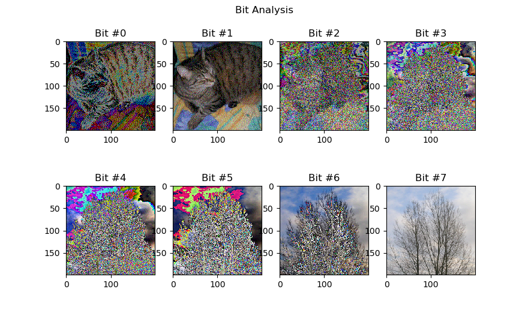

# Steganography Analysis Library

This is a collection of tools to analyse data for steganographically hidden content.

## Bit Analysis

Processes an image and extracts each bit in all color channels in order to find hidden data (especially in the lower bits of an image).

With the [example from wikipedia](https://en.wikipedia.org/wiki/Steganography) and `bit_analysis.py` the following graphic is generated:

